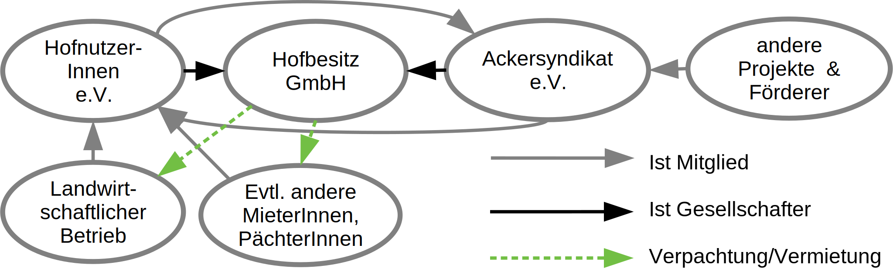

<figure>
<audio controls>
  <source src="./201216_Podcast_Lorenz_Jost_Ackersyndikat.mp3">
</audio>
<figcaption>
“Wem gehört der Acker?“ – Podcast von Lorenz Bücheler mit Jost Burhop
</figcaption>
</figure>

Das Ackersyndikat ist ein dezentraler Solidarverbund von selbstorganisierten Höfen. Im Ackersyndikat gehören die landwirtschaftlichen Flächen immer den Menschen, die sie ökologisch verantwortlich bewirtschaften und nutzen. Das Land ist dabei nicht Privateigentum, sondern unverkäufliches Gemeingut (Common). Die Höfe sind als <abbr title="Gesellschaft mit beschränkter Haftung">GmbH</abbr> mit zwei Gesellschafterinnen organisiert. Das ist einmal mit dem Hauptanteil der Hofnutzer\*innen-Verein, in dem alle Nutzer\*innen des Landes organisiert sind und durch den in Selbstorganisation das Land verwaltet und genutzt wird. Zum Zweiten ist der Ackersyndikat <abbr title="eingetragener Verein">e.V.</abbr> Gesellschafterin der Hof-GmbH und garantiert über ein Vetorecht die Unverkäuflichkeit des GmbH-Besitzes. Der Verein hat als Wächterinstitution lediglich ein Stimmrecht bei GmbH-Satzungsänderungen, der Genehmigung des Jahresabschlusses und der Frage eines Verkaufs – der damit für immer ausgeschlossen wird. Zudem sorgt das Ackersyndikat für eine solidarische Zusammenarbeit der Höfe und ermöglicht Wissenstransfer, Beratung, finanziellen Beistand und eine gemeinsame Interessensvertretung.

Vorbild hierfür ist das [Mietshäuser Syndikat](https://syndikat.org), welches viele Werte, Motivationen und Strukturen mit dem Ackersyndikat teilt. Gemeinsamkeiten und Unterschiede von Ackersyndikat und Mietshäuser Syndikat sind [hier]() dargestellt.

Einer der grundlegenden Werte des Ackersyndikats ist die Autonomie der einzelnen Hofprojekte. Dies bedeutet, dass alle alltäglichen Fragen der Ausgestaltung des Projektes inklusive der Geschäftsführung den Nutzer\*innen des Hofes überlassen sind. Dem Ackersyndikat wird lediglich bei Neuverpachtungen des ganzen Hofes eine voraussichtlich aktivere Rolle zukommen, um die Kontinuität der Hofprojekte und den Erhalt der Grundwerte der Ackersyndikats- Projekte und des Ackersyndikats zu sichern. Daher ist es auch im Hofnutzer\*innen-Verein Mitglied. Denn bei Höfen gibt es im Gegensatz zu den Mietshäusern oft nur eine\*n Pächter\*in, so dass eine Kontinuität nicht über viele Bewohner\*innen von alleine entsteht.

Finanziert werden die Projekte über Direktkredite aus dem Umfeld der Nutzerer\*innen, und über übliche Bankdarlehen. Die Beteiligung des Ackersyndikats an Hofprojekten wird auch über [Spenden]() und [Direktkredite]() ans Ackersyndikat ermöglicht. , Darum freuen wir uns sehr über Deine Unterstützung!

#### Vorteile des Ackersyndikats im Vergleich...

| zu zentralen Genossenschaften                                       | zu Einzelgenossenschaften / Vereinen                                                |
| ------------------------------------------------------------------- | ----------------------------------------------------------------------------------- |
| Kollektive Selbstbestimmung der Hofnutzer\*innen – Projektautonomie | Starthilfe u.a. durch Beratung, Vertragsvorlagen erprobtes Konzept                  |
| Selbstverantwortung und Risikoabgrenzung                            | Vernetzung und Austausch hält Projekte lebendig und gibt Hilfe in Krisensituationen |
| lokale Umfeldfinanzierung ohne Mehrkosten für den Hof               | Zuschuss zum Startkapital aus Solidarverbund                                        |
| Keine verpflichtende Genossenschaftseinlage für Nutzer\*innen       | Verkauf dauerhaft ausgeschlossen                                                    |
| Verkauf der Immobilien dauerhaft ausgeschlossen                     |                                                                                     |

### Aktueller Stand



- Im November 2020 wurde der Verein Ackersyndikat e.V gegründet
- Im September 2022 wurde der Beteiligungsbeschluss für das erste Projekt - die Obermühle Steudnitz - gefällt 
- Es gibt Anfragen von ca. 20 Höfen und Initiativen, die Teil des Ackersyndikats werden wollen
- Einige Projekte sind im ausführlichen Beratungs- und Annäherungsprozess
- Ackersyndikats-Projekten stehen fertig ausgearbeitete Finanzierungspläne zur Verfügung, mit denen sich die wirtschaftliche Machbarkeit von Projekten klären lässt.
- Im Solidarverbund des Ackersyndikats bündeln sich diverse Expertisen. Auf dieses Wissen können die Hof-Projekte zurückgreifen.
- Es gibt finanzielle Mittel für einige Projektbeteiligungen
- Wir freuen uns über weitere Anfragen von Höfen, die Teil des Ackersyndikats werden wollen – mehr Informationen dazu gibt es [hier](). Zudem freuen wir uns sehr über Unterstützung, zum Beispiel durch [ehrenamtliche Mitarbeit]() oder durch [Spenden]() und [Direktkredite](). Fragen beantworten wir gerne unter kontakt@ackersyndikat.org.
