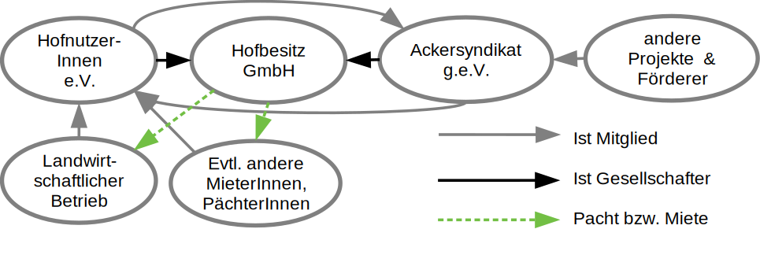

### Wie ist das Ackersyndikat entstanden?

Das Ackersyndikat ist durch die Kombination der Ideen von Solidarischer Landwirtschaft und dem Mietshäuser Syndikat entstanden. Hier könnt ihr erfahren, was die Unterschiede und Gemeinsamkeiten von diesen Organisationen und dem Ackersyndikat sind:

### Mietshäuser Syndikat – Gemeinsamkeiten und Unterschiede:

Das Mietshäuser Syndikat (MHS) ist ein Solidarverbund von mittlerweile mehr als 150 selbstorganisierten Hausprojekten. Neben dem Rückgriff auf jahrelange Beratungsexpertise, hat das Ackersyndikat zu großen Teilen die rechtlichen Strukturen vom MHS übernommen, ebenso die Finanzpläne. Weitergehende Infos zum MHS gibt es [hier](https://syndikat.org).

#### Doch warum braucht es dann ein Ackersyndikat zusätzlich zum MHS?

Die Vorteile des MHS sind weitgehend auf Höfe und landwirtschaftliche Flächen übertragbar. Daher gab es auch schon einige Anfragen, vor allem von [Solawi](#solawi) Höfen, sich dem MHS anzuschließen. Zugleich zeigten sich auch deutliche Differenzen: rechtlich mit dem Grundstücksverkehrsgesetz, das den Kauf von Höfen durch Nichtlandwirt\*innen unterbinden soll; finanziell wegen der in der Landwirtschaft viel geringeren Erträgen, die einen nennenswerten Solidartransfer, wie er zwischen den Projekten im MHS angelegt ist, erschweren; der Fokus liegt statt auf quasi unkündbaren Wohnraummietverhältnisse auf unkündbaren landwirtschaftlichen Pachtverträgen und Betriebswohnungen.  
Die in der Landwirtschaft zentralen Werte der Sicherung eines lebensfähigen, vielfältigen Hoforganismus und einer die Bodenfruchtbarkeit aufbauenden Bewirtschaftung gestalten die Projektautonomie im Ackersyndikat etwas anders als im MHS. Bei Höfen gibt es oft nur eine\*n Pächter*\in im Gegensatz zu der die Kontinuität sichernden Vielzahl von Mieter*\innen in den Wohnprojekten des MHS. Daher wird die Rolle eines Ackersyndikats nicht auf eine reine Wächter- und Vernetzungsinstitution zu reduzieren sein. Im Falle einer Neuverpachtung der landwirtschaftlichen Flächen an einen neuen Betrieb wird wahrscheinlich eine aktivere Rolle zur Unterstützung bei der Betriebssuche erforderlich sein. In der Landwirtschaft sind zudem Gründe für eine Gemeinnützigkeit gegeben, während die Schaffung preisgünstigen Wohnraums in Deutschland leider nicht (mehr) gemeinnützig ist. Damit bietet sich ein gemeinnütziger Verein als Vernetzungsinstitution in Form des Ackersyndikat e.V.s an. Die auf die Landwirtschaft angepasste Organisation des Ackersyndikats hat daher gegenüber dem MHS eine leicht modifizierte Struktur:

Die Gemeinnützigkeit des Ackersyndikats gründet sich auf den ökologischen und gesellschaftspolitischen Zielen des Ackersyndikats. Neben der Förderung des Umwelt-, Natur-, Tier und Artenschutzes sowie der Bildung für nachhaltige Entwicklung, sind auch gesellschaftspolitische Ziele wie die Förderung des ländlichen Raumes und weitere Maßnahmen zur Förderung des demokratischen Staatswesens konkret in der Satzung verankert. Auf diese [Ziele](/unterstuetzen/mitgliedschaft/Ackersyndikat_Satzung_1.0.pdf) stützt sich unsere Gemeinnützigkeit. Durch die relativ geringen finanziellen Erträge in der Landwirtschaft wird es zwingend erforderlich sein auch Spendengelder einzuwerben. Die Gemeinnützigkeit schafft eine klare Basis um den ohnehin geringen Solidartransfer zwischen den Projekten nicht durch Besteuerung zu belasten.

Diese Unterschiede zwischen dem Solidarverbund des Mietshäuser Syndikats und dem Solidarverbund des Ackersyndikats sind allerdings Mittel zum Zweck. Das Ackersyndikat sieht sich als Schwesterorganisation des MHS und ist diesem durch die große Überschneidung der Ziele sehr verbunden.

<h3 id="solawi">Solidarische Landwirtschaft (Solawi) und Ackersyndikat– Gleiche Ideen, unterschiedliche Wirkungsbereiche</h3>

Das Netzwerk Solidarische Landwirtschaft ist ein Zusammenschluss von regionalen Projekten, die nicht-industrielle, marktunabhängige, ökologische Landwirtschaft betreiben. Hierbei finanziert eine Verbraucher\*innengemeinschaft den landwirtschaftlichen Betrieb als solchen, anstatt für das einzelne Lebensmittel zu zahlen. Neben ökologischer Landwirtschaft geht es dabei auch um soziale Aspekte wie etwa faire Löhne und gegenseitige Unterstützung.  
Das Ackersyndikat teilt die Ideen und Ziele der solidarischen Landwirtschaft. Der entscheidende Unterschied besteht darin, dass sich das Ackersyndikat auf Landeigentum bezieht, während sich das [Netzwerk Solidarische Landwirtschaft](https://www.solidarische-landwirtschaft.org/startseite) auf eine Wirtschaftsweise landwirtschaftlicher Betriebe fokussiert. Es ist also nicht „entweder Solawi oder Ackersyndikat“. Ackersyndikat und solidarische Landwirtschaft sind vielmehr Modelle, die sich gegenseitig unterstützen und gemeinsam autonome, ökologische und solidarische Hofprojekte ermöglichen.
